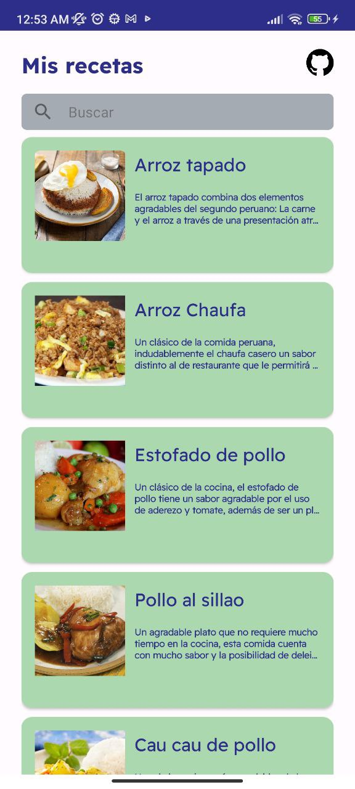
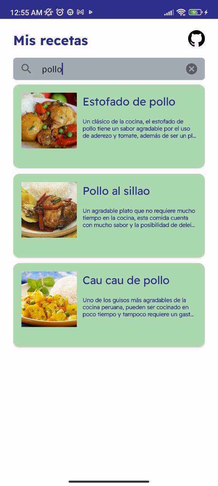
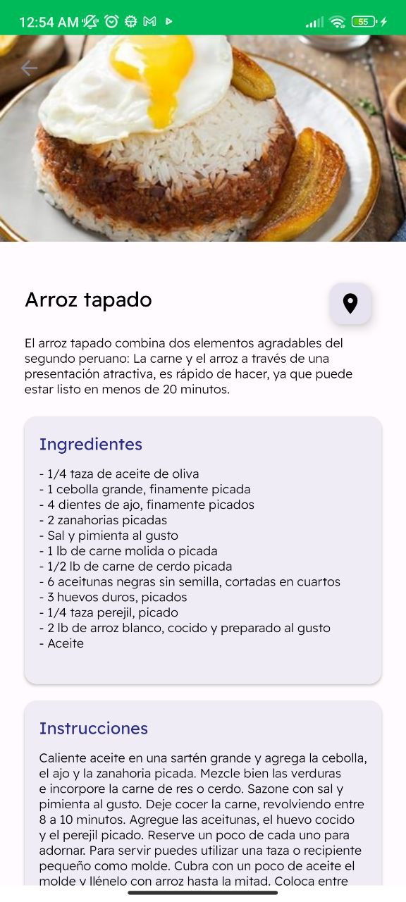
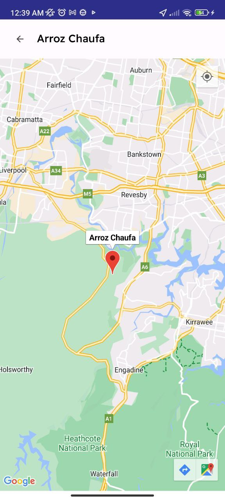

<h1 align="center">Challenge Yape 2023 : Recipes App</h1>

    <a href="https://www.linkedin.com/in/gonzalo-lozg/">Linkedin</a> •
    <a href="https://github.com/gonzalo-droid">Github</a> •
    <a href="https://www.instagram.com/gonzalo.lozg/">Instagram</a>
      

Proyecto desarrollo con el objetivo de cumplir el reto propuesto por "Yape".

El contexto del proyecto es una app de recetas en la cuál listaremos recetas, mostraremos el detalle
de cada receta y la localización geográfica de su origin.

El proyecto se derrollo bajo el patrón de presentación MVVM y Clean Architecture con el fin de
presentar un proyecto escalable, mantenible y testeable.

Tambien utilice Material Design 3, Kotlin Coroutines, Hilt.

- Formato de commits:
    - [Conventional Commits 1.0.0](https://www.conventionalcommits.org/en/v1.0.0/)

- Repositorio del proyecto [Github]:
    - [Recipes App](https://github.com/gonzalo-droid/recipes-yape-android)

- Api mockable usando:  [Mockable](https://www.mockable.io/)
    - `docs/api/list_recipes.json`

## Screenshots

      

## Demo

https://github.com/gonzalo-droid/recipes-yape-android/assets/35148569/5ca67e98-9ab5-4255-99c0-7fdce88e459d

### Estructura del proyecto

- core
    - di: Módulo de injección de dependencias
- data
    - remote: validación de conexión y llamado a servicios
    - repository: manipulación de la fuente de datos
- domain
    - repository: interfaz de acceso para el respositorio de la capa de "data"
    - useCase: casos de uso
- presentation
    - features: View + ViewModel
        - detail
        - home
        - maps
        - splash

### Testing and lint

- Testing el la vista home dónde realizamos el llamado a los servicios
    - RecipeRepositoryImplTest
    - GetRecipesUseCaseTest
    - HomeViewModelTest

- [Ktlint](https://github.com/JLLeitschuh/ktlint-gradle)
    - Este plugin crea cómodas tareas en tu proyecto Gradle que ejecutan comprobaciones ktlint o
      hacen autoformateo de código.
    - run ktlint: `./gradlew ktlintFormat`

## Features

- Listar recetas en el home.
- Buscador de recetas, filtro por nombre de la receta.
- Mostrar detalle de las recetas (imagen, descripción, ingredientes e instrucciones).
- Mostrar localización geográfica en google maps con las coordenas obtenidas en cada receta.

## IDE Version

Android Studio Flamingo (2022.2.1 Patch 2)
